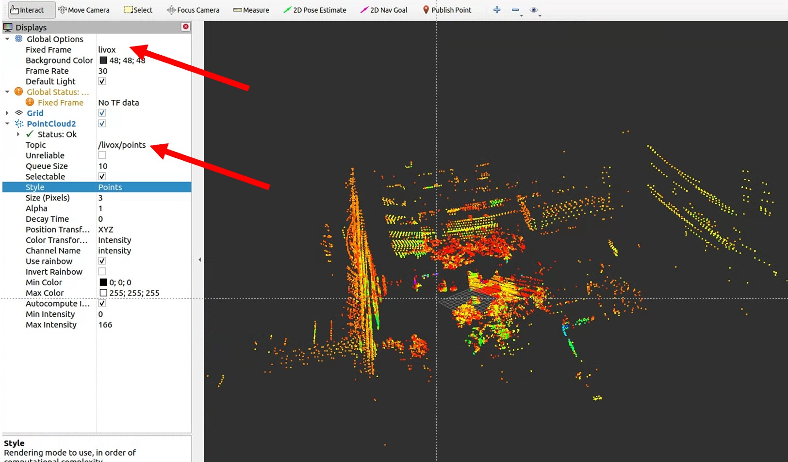

## livox_repub
republish livox raw message to standard pointcloud2


## install

```
mkdir -p ~/catkin_ws_livox_repub/src
cd ~/catkin_ws_livox_repub/src
git clone https://github.com/kafeiyin00/livox_repub.git
cd ..
catkin_make
```

## config your message in launch file

The default livox_raw_message_name is "/livox/lidar". livox_points_message_name is "/livox/points".

```
<launch>
   <node pkg="livox_repub" type="livox_repub_online_node" name="livox_repub_online_node" output="screen" >
      <param name="livox_raw_message_name"    type="string"   value="/livox/lidar" />
      <param name="livox_points_message_name"    type="string"   value="/livox/points" />
   </node>
</launch>
```

## visualize in RVIZ


